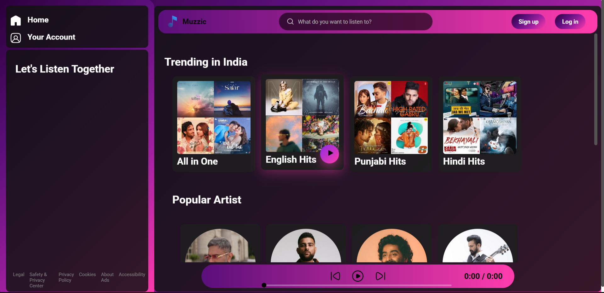

# A-Music-website-using-HTML-CSS-and-JS
A modern and responsive music website developed using HTML, CSS, and JavaScript. The project focuses on an intuitive user interface, interactive music controls, and responsive design across devices.

  
  

